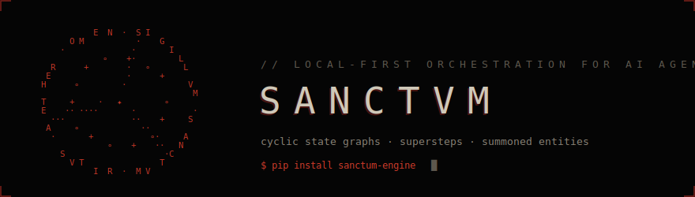
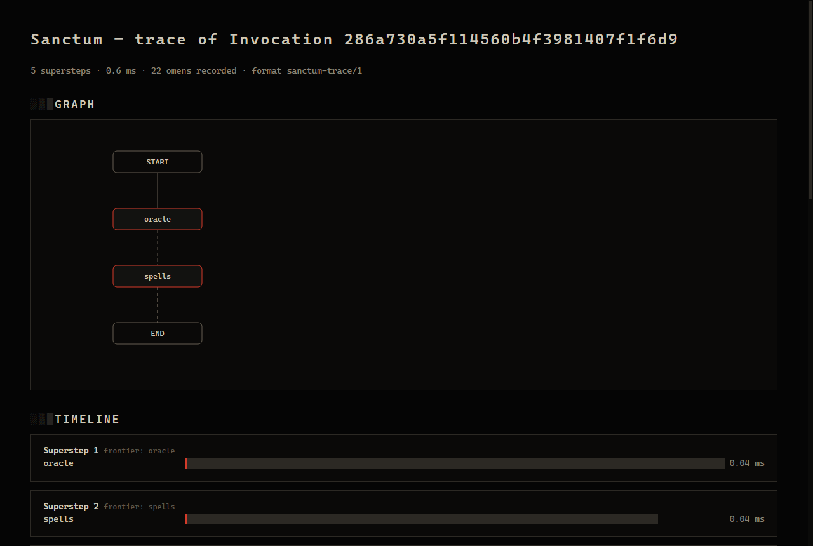

<p align="center">
  
</p>

# Sanctum

[](https://github.com/zquintero246/sanctum-engine/actions/workflows/ci.yml)
[](https://pypi.org/project/sanctum-engine/)
[](https://github.com/zquintero246/sanctum-engine/actions/workflows/ci.yml)
[](LICENSE)
[](pyproject.toml)

> 🇬🇧 [Read this in English](README.md)

*Donde los agentes se invocan, se ligan y se ponen a trabajar — un motor
de orquestación mínimo y local-first para grafos de estados cíclicos.*

Sanctum modela la orquestación multiagente como un ritual de invocación:
el conocimiento vive en el Grimorio (herramientas), el Sanctum prepara y
controla el ritual (el motor), las entidades son invocadas (agentes), y
todas cooperan sobre una energía compartida — el Aether (estado) — hasta
manifestar un resultado. Bajo la metáfora hay un modelo de ejecución
preciso: un **grafo de estados cíclico** ejecutado por supersteps
(Pregel/BSP), donde los nodos corren en paralelo, devuelven deltas
parciales de estado fundidos mediante reducers por canal, y los edges
condicionales cierran los ciclos que hacen posible el comportamiento
agéntico (pensar → actuar → observar → …). El núcleo es pura librería
estándar de Python — sin APIs propietarias, sin dependencias
obligatorias — diseñado para correr por completo con modelos locales.

**[Documentación](https://zquintero246.github.io/sanctum-engine/)** ·
[Primeros pasos](https://zquintero246.github.io/sanctum-engine/getting-started/) ·
[Comparación con LangGraph / n8n / ADK](https://zquintero246.github.io/sanctum-engine/comparison/) ·
[Documento de diseño](docs/architecture.md)



## Características

| | |
|---|---|
| **Grafos de estados cíclicos** | Supersteps BSP, fan-out estático, edges condicionales, ciclos acotados por `recursion_limit` — no un DAG |
| **Estado determinista** | Reducers por Conduit aplicados en orden de inserción de Sigils; corridas idénticas, incluso en paralelo |
| **Joins wait-all** | `join="all"` vuelve un Sigil una barrera sobre sus predecesores — ramas desiguales convergen, entre supersteps, sobreviviendo checkpoints |
| **Circles — subgrafos** | Monta un Rite compilado como un solo Sigil: un agente invocado se vuelve un nodo de un pipeline mayor, con sus eventos internos ecoados al stream exterior |
| **Scatter — map-reduce** | Fan-out sobre una lista de tamaño dinámico con concurrencia acotada; resultados en orden de item |
| **Oracles local-first** | Ollama (nativo y `/v1`), llama-server, vLLM, LM Studio, GGUF in-process — jamás una API propietaria en el núcleo |
| **Tool-calling robusto** | JSON malformado reparado, Spells desconocidos corregidos conversacionalmente, fallback prompted para modelos sin tools |
| **Seals y time-travel** | Checkpoints JSON por superstep (memoria/SQLite/Postgres), reanudación, `interrupt()` human-in-the-loop, replay desde cualquier Seal |
| **Omens en streaming** | Eventos tipados con timestamp; modos combinables; tokens en vivo desde dentro de un Sigil |
| **Políticas de resiliencia** | Timeout por Sigil, reintentos con backoff+jitter, Sigils de fallback leyendo `__errors__` |
| **Middleware de Wards** | Transforma o veta deltas, observa cada evento: auditoría JSONL, conteo de uso, redacción |
| **Trazas locales** | Visor HTML de un solo archivo, cero requests externos: `python -m sanctum.trace render run.sanctum-trace.json` |
| **Núcleo sin dependencias** | Solo stdlib de Python; todo lo demás es un extra opcional |

## Inicio rápido

```sh
pip install sanctum-engine
```

```python
from sanctum import END, Ritual

ritual = Ritual()
ritual.add_sigil("cleanse", lambda aether: {"text": aether["text"].strip()})
ritual.add_sigil("transmute", lambda aether: {"text": aether["text"].upper()})
ritual.set_entry_point("cleanse")
ritual.add_edge("cleanse", "transmute")
ritual.add_edge("transmute", END)

rite = ritual.compile()
print(rite.invoke({"text": "  fiat lux  "}))
# {'text': 'FIAT LUX'}
```

## Invocar una Entidad

`summon()` construye el ciclo ReAct canónico (oracle → spells → oracle →
… → END) enteramente sobre las primitivas públicas:

```python
import asyncio
from sanctum import Tome, spell, summon
from sanctum.oracle.ollama import OllamaOracle   # pip install "sanctum-engine[ollama]"

@spell
def word_count(text: str) -> int:
    """Count the words in a text."""
    return len(text.split())

entity = summon(
    OllamaOracle(arcana="qwen2.5:7b"),
    Tome([word_count]),
    role="You are a scribe.",
    spell_calling="auto",   # fallback prompted si el modelo no tiene tools nativas
)
result = asyncio.run(entity.ainvoke(
    {"messages": [{"role": "user", "content": "How many words in 'fiat lux'?"}]}
))
print(result["messages"][-1]["content"])
```

## Ejemplos

La galería de [`examples/`](examples/) corre con oracles guionados por
defecto — no requiere modelo — y cada script acepta `--oracle ollama`:

- [`quickstart_ollama.py`](examples/quickstart_ollama.py) — chat con una
  herramienta en treinta líneas.
- [`research_ritual/`](examples/research_ritual/) — dos entidades
  exploran en paralelo (fan-out), una tercera sintetiza (fan-in, reducer
  append).
- [`human_in_the_loop/`](examples/human_in_the_loop/) — `interrupt()` +
  Codex: pausa para aprobación, reanuda donde quedó.
- [`resilient_pipeline/`](examples/resilient_pipeline/) — reintentos,
  timeouts y un Sigil de fallback en una corrida observable.
- [`sse_flask.py`](examples/sse_flask.py) — puente de `astream` a
  Server-Sent Events.

## Ecosistema

Sanctum es dueño de la ejecución;
[AgentGrimoire](https://github.com/zquintero246/AgentGrimoire) es dueño
de la capacidad — una biblioteca de herramientas con carpeta por Spell,
cargable por convención con `Tome.load_from_directory(path)`; y
[Sanctum Studio](https://github.com/zquintero246/sanctum-studio) hace
visible la cámara — un builder visual y dashboard local donde los ritos
se dibujan en un lienzo, corren en vivo superstep a superstep, se pausan
para aprobación humana y viajan en el tiempo. Cada pieza evoluciona sin
tocar a las demás.

## Desarrollo

```sh
pip install -e ".[dev]"
ruff check . && pytest --cov=sanctum      # suite unitaria: sin modelos, sin servicios
python benchmarks/superstep_overhead.py  # overhead del motor: decenas de µs/superstep
```

Contribuciones bienvenidas — mira [CONTRIBUTING.md](CONTRIBUTING.md)
(incluye cómo correr los tests de integración opt-in contra un Ollama
local) y el [documento de diseño](docs/architecture.md) para el
razonamiento detrás de cada trade-off. Licencia [MIT](LICENSE).

---

```text
                E  N  ·  S I
           O M           ·    G
         ·              ·       I
                  ∘    +·         L
       R      +        ·   ∘       L
      E                ·      +
     H      ∘         ·             V
                                     M
     T     +     ·   ✦         ∘
     E    ·· ····       ·            ·
       ···              ··    +     S
      A     ∘             ··
       ·       +            ∘·     A
                   ∘    +    ··   N
         S                     ·C
           V T                T
                I  R  ·  M V

        la cámara está abierta · solo local · sin telemetría
```
