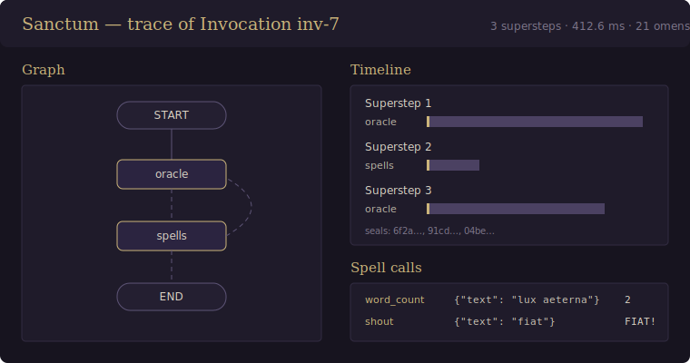

# Sanctum

[](https://github.com/zquintero246/sanctum-engine/actions/workflows/ci.yml)
[](https://pypi.org/project/sanctum-engine/)
[](https://github.com/zquintero246/sanctum-engine/actions/workflows/ci.yml)
[](LICENSE)
[](pyproject.toml)

*Where agents are summoned, bound, and set to work — a minimal, local-first
orchestration engine for cyclic state graphs.*

Sanctum models multi-agent orchestration as a ritual of invocation:
knowledge lives in the Grimoire (tools), the Sanctum prepares and controls
the ritual (the engine), entities are summoned (agents), and all of them
cooperate over a shared energy — the Aether (state) — until a result is
manifested. Beneath the metaphor sits a precise execution model: a **cyclic
state graph** run by supersteps (Pregel/BSP), where nodes execute in
parallel, return partial state deltas merged through per-channel reducers,
and conditional edges close the loops that make agentic behavior
(think → act → observe → …) possible. The core is pure Python standard
library — no proprietary APIs, no mandatory dependencies — designed to run
entirely on local models.

**[Documentation](https://zquintero246.github.io/sanctum-engine/)** ·
[Getting started](https://zquintero246.github.io/sanctum-engine/getting-started/) ·
[Comparison with LangGraph / n8n / ADK](https://zquintero246.github.io/sanctum-engine/comparison/) ·
[Design document](docs/architecture.md)



## Features

| | |
|---|---|
| **Cyclic state graphs** | BSP supersteps, static fan-out, conditional edges, cycles bounded by `recursion_limit` — not a DAG |
| **Deterministic state** | Per-Conduit reducers applied in Sigil insertion order; identical runs, even under parallelism |
| **Local-first Oracles** | Ollama (native & `/v1`), llama-server, vLLM, LM Studio, in-process GGUF — never a proprietary API in the core |
| **Robust tool-calling** | Malformed JSON repaired, unknown Spells corrected conversationally, prompted fallback for models without tools |
| **Seals & time-travel** | JSON checkpoints per superstep (memory/SQLite/Postgres), resume, `interrupt()` human-in-the-loop, replay from any Seal |
| **Streaming Omens** | Typed, timestamped events; combinable modes; live tokens from inside a Sigil |
| **Resilience policies** | Per-Sigil timeout, retries with backoff+jitter, fallback Sigils reading `__errors__` |
| **Wards middleware** | Transform or veto deltas, observe every event: audit JSONL, usage tally, redaction |
| **Local tracing** | One-file HTML viewer, zero external requests: `python -m sanctum.trace render run.sanctum-trace.json` |
| **Zero-dependency core** | Python stdlib only; everything else is an optional extra |

## Quickstart

```sh
pip install sanctum-engine
```

```python
from sanctum import END, Ritual

ritual = Ritual()
ritual.add_sigil("cleanse", lambda aether: {"text": aether["text"].strip()})
ritual.add_sigil("transmute", lambda aether: {"text": aether["text"].upper()})
ritual.set_entry_point("cleanse")
ritual.add_edge("cleanse", "transmute")
ritual.add_edge("transmute", END)

rite = ritual.compile()
print(rite.invoke({"text": "  fiat lux  "}))
# {'text': 'FIAT LUX'}
```

## Summoning an Entity

`summon()` builds the canonical ReAct loop (oracle → spells → oracle → …
→ END) entirely on the public primitives:

```python
import asyncio
from sanctum import Tome, spell, summon
from sanctum.oracle.ollama import OllamaOracle   # pip install "sanctum-engine[ollama]"

@spell
def word_count(text: str) -> int:
    """Count the words in a text."""
    return len(text.split())

entity = summon(
    OllamaOracle(arcana="qwen2.5:7b"),
    Tome([word_count]),
    role="You are a scribe.",
    spell_calling="auto",   # prompted fallback if the model lacks native tools
)
result = asyncio.run(entity.ainvoke(
    {"messages": [{"role": "user", "content": "How many words in 'fiat lux'?"}]}
))
print(result["messages"][-1]["content"])
```

## Examples

The [`examples/`](examples/) gallery runs on scripted oracles by default —
no model required — and every script takes `--oracle ollama`:

- [`quickstart_ollama.py`](examples/quickstart_ollama.py) — chat with a
  tool in thirty lines.
- [`research_ritual/`](examples/research_ritual/) — two entities scout in
  parallel (fan-out), a third synthesizes (fan-in, append reducer).
- [`human_in_the_loop/`](examples/human_in_the_loop/) — `interrupt()` +
  Codex: pause for approval, resume where it stopped.
- [`resilient_pipeline/`](examples/resilient_pipeline/) — retries,
  timeouts, and a fallback Sigil in one observable run.
- [`sse_flask.py`](examples/sse_flask.py) — bridge `astream` to
  Server-Sent Events.

## Ecosystem

Sanctum owns execution; [AgentGrimoire](https://github.com/zquintero246/AgentGrimoire)
owns capability — a folder-per-Spell tool library loadable by convention
with `Tome.load_from_directory(path)`. Either side evolves without
touching the other.

## Development

```sh
pip install -e ".[dev]"
ruff check . && pytest --cov=sanctum      # unit suite: no models, no services
python benchmarks/superstep_overhead.py  # engine overhead: tens of µs/superstep
```

Contributions welcome — see [CONTRIBUTING.md](CONTRIBUTING.md) (includes
how to run the opt-in integration tests against a local Ollama) and the
[design document](docs/architecture.md) for the rationale behind every
trade-off. Licensed [MIT](LICENSE).
